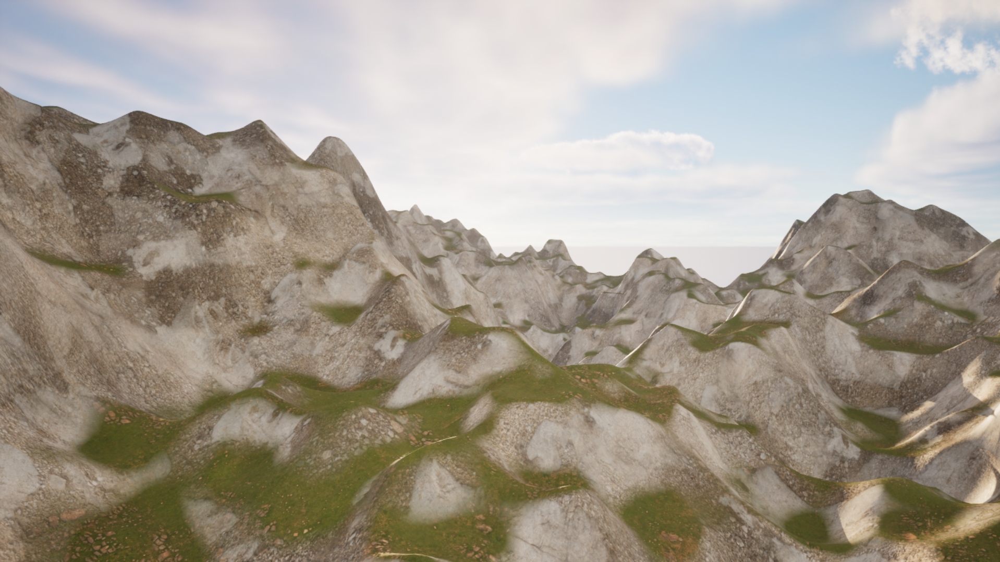
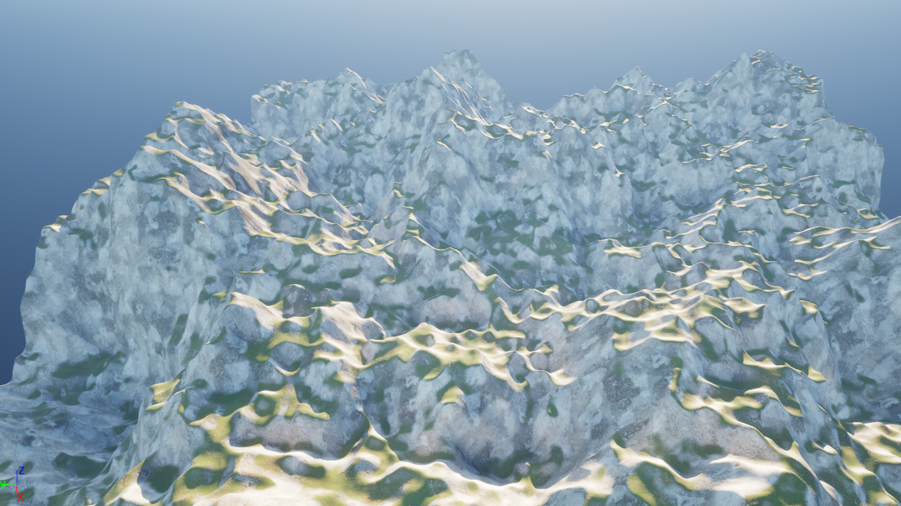
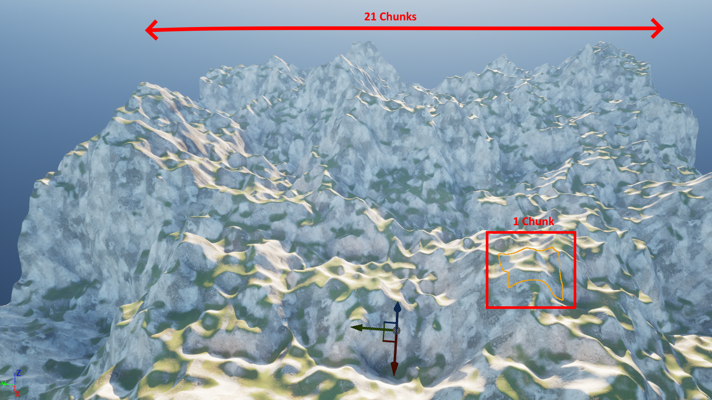
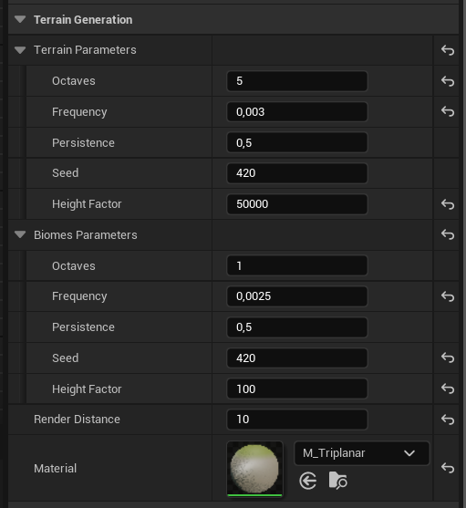

# ProceduralTerrainGeneration--UnrealEngine5-2024

This project is a student project implementing ***Procedural Terrain Generation*** with chunk system, realized in **C++ with Unreal Engine 5** for our Master's 2 degree in game development. It generates an infinite terrain using Perlin noise, with dynamic chunk loading/unloading based on player position, and features a triplanar material system for realistic terrain texturing.



## Summary

- [Project pitch](#project-pitch)
- [Project demo](#project-demo)
- [Technical Section](#technical-section)
- [How to play the demo](#how-to-play-the-demo)
- [Possible improvements](#possible-improvements)

## Project pitch

This project implements an **infinite procedural terrain generation system** using Unreal Engine 5 and C++.

**Features included:**
- Infinite terrain generation using chunk system
- Multi-threaded chunk generation
- Dynamic chunk loading/unloading based on player position
- Perlin noise-based height generation with multiple octaves
- Realistic terrain material with triplanar mapping
- Normal calculation for proper lighting
- Memory-efficient mesh generation

**Controls:**
- Forward > `Z`
- Left > `Q`
- Backward > `S`
- Right > `D`
- Look > `Mouse`

**Development team:**
- [Léo Séry](https://github.com/LeoSery)
- [Thibaut le perf](https://github.com/pepsithib)

## Project demo

### Inifinite chunk generation


### How a chunk is generated


### Project pictures



> *Overview of the chunk system with a render distance of 10, resulting in a 21x21 grid ((2 * 10 + 1) * (2 * 10 + 1) = 441 chunks). The red square highlights a single chunk. The terrain is dynamically generated and updated as the player moves, with chunks being created and destroyed to maintain performance.*

## Technical Section

The project is built around three main subsystems that handle different aspects of the terrain generation:

- [`ChunkManagerWorldSubsystem`](Source/PTG/Generation/Subsystems/ChunkManagerWorldSubsystem.h)
  - Manages chunk lifecycle (creation and destruction)
  - Handles chunk loading based on player position
  - Coordinates generation requests

- [`TerrainGeneratorWorldSubsystem`](Source/PTG/Generation/Subsystems/TerrainGeneratorWorldSubsystem.h)
  - Creates and stores chunk data
  - Manages chunk meshes
  - Handles terrain parameters

- [`ProceduralMeshGeneratorSubsystem`](Source/PTG/Generation/Subsystems/ProceduralMeshGeneratorSubsystem.h)
  - Creates the actual mesh geometry
  - Calculates vertices and triangles
  - Manages mesh optimization

### 1. Core Architecture

```cpp
struct FChunk {
    TArray<FVertices> VertexArray;
    int32 Size;
    FVector Coords;
    int64 Id;
};

FORCEINLINE int64 ChunkData::GetChunkIdFromCoordinates(int32 X, int32 Y)
{
    return ((int64)X << 32) | ((int64)Y & 0xFFFFFFFF);
}
```

- Communication between subsystems is handled through delegates:
```cpp
DECLARE_MULTICAST_DELEGATE_OneParam(FOnChunkGenerationComplete, int64);
FOnChunkGenerationComplete OnChunkGenerationComplete;
```

### 2. Multi-threaded Generation

- Chunks are generated asynchronously using dedicated worker threads:

```cpp
class FChunkThread : public FRunnable 
{
    virtual uint32 Run() override
    {
        // Generate height values in batches for better performance
        const int BatchSize = 100;
        int processedVertices = 0;
        
        for (int y = _y; y < _y + _size; y++)
        {
            for (int x = _x; x < _x + _size; x++)
            {
                float Z = GenerateOctavePerlinSmoothed(x, y, Parameters);
                TempVertices.Add(FVertices{FVector(x_scaled, y_scaled, Z)});
                
                if (++processedVertices % BatchSize == 0)
                {
                    FPlatformProcess::Sleep(0.001f);
                }
            }
        }
    }
};
```

- Dynamic chunk loading based on player position:
```cpp
void UChunkManagerWorldSubsystem::Tick(float DeltaTime)
{
    // Queue new chunks within render distance
    for (int y = PlayerPos.Y - RenderDistance; y <= PlayerPos.Y + RenderDistance; y++)
    {
        for (int x = PlayerPos.X - RenderDistance; x <= PlayerPos.X + RenderDistance; x++)
        {
            if (!TerrainGenerator->HasChunk(ChunkId))
            {
                ChunkGenerationQueue.Enqueue(FVector2D(x, y));
            }
        }
    }

    // Queue distant chunks for destruction
    int32 playerQuadX = FMath::RoundToInt(PlayerPos.X * (ChunkSize - 1));
    int32 playerQuadY = FMath::RoundToInt(PlayerPos.Y * (ChunkSize - 1));
    
    for (auto& [id, chunk] : TerrainGenerator->ChunkMap)
    {
        if (IsChunkOutOfRange(chunk, playerQuadX, playerQuadY))
        {
            ChunkDestructionQueue.Enqueue(id);
        }
    }
}
```

### 3. Terrain Generation

- Configurable noise parameters for terrain customization:
> Default values defined in the [build version](https://github.com/LeoSery/ProceduralTerrainGeneration--UnrealEngine5-2024/releases/tag/V1.0).
```cpp
struct FPerlinParameters
{
    int32 Octaves = 5;
    float Frequency = 0.003f;
    float Persistence = 0.5f;
    int32 Seed = 420;
    int32 HeightFactor = 50000;
};
```

- Advanced noise generation with gradient-based smoothing:
```cpp
float UPerlinNoise::GenerateOctavePerlinSmoothed(float _x, float _y, 
    int32 _octaves, float _persistence, float _frequency, int _seed,
    float _gradientPower, float _gradientSmoothing, FVector2D eps)
{
    FVector2D gradientSum(0.0f);
    for (int i = 0; i < _octaves; i++)
    {
        float p00 = GeneratePerlinValue(_x, _y, i, _frequency, _seed);
        FVector2D gradient = CalculateGradient(p00, _x, _y, eps);
        float layerInfluence = 1.0f / (1.0f + _gradientPower * gradientSum.Length());
        
        total += p00 * amplitude * layerInfluence;
        amplitude *= _persistence * FMath::Lerp(1.0f, layerInfluence, _gradientSmoothing);
    }
    return total / maxValue;
}
```

### 4. Mesh Optimization

- Memory-efficient mesh generation with vertex sharing and normal calculation:
```cpp
void UProceduralMeshGeneratorSubsystem::CreateChunkMesh(
    UProceduralMeshComponent* ProceduralMesh, const FChunk& Chunk)
{
    // Optimize memory by pre-allocating arrays
    const int32 NumVertices = Chunk.Size * Chunk.Size;
    Vertices.Reserve(NumVertices);
    Normals.Reserve(NumVertices);
    
    // Calculate vertex normals for lighting
    for (int32 i = 0; i < Triangles.Num(); i += 3)
    {
        const FVector Edge1 = Vertices[Triangles[i + 1]] - Vertices[Triangles[i]];
        const FVector Edge2 = Vertices[Triangles[i + 2]] - Vertices[Triangles[i]];
        const FVector TriangleNormal = FVector::CrossProduct(Edge1, Edge2).GetSafeNormal();
        
        Normals[Triangles[i]] += TriangleNormal;
        Normals[Triangles[i + 1]] += TriangleNormal;
        Normals[Triangles[i + 2]] += TriangleNormal;
    }
}
```

## How to play the demo

### Method 1: Build Version (With default parameters)
1. Go to the [Releases page](https://github.com/LeoSery/ProceduralTerrainGeneration--UnrealEngine5-2024/releases/tag/V1.0)
2. Download the latest version
3. Launch the executable
4. Explore the procedurally generated terrain using the controls above


### Method 2: From Source (Customizable Parameters)
1. Clone the repository
2. Open the project in Unreal Engine 5.4 or later
3. Open the `PTG` map in the Content Browser
4. Configure terrain generation parameters in `Content/PTG/GameMode/PTG_GameMode.uasset`:
   
5. Click Play in the editor to test with your custom parameters
6. Use the controls above to explore the terrain

## Possible improvements

1. **Generation Enhancements:**
   - Implement biome system using additional noise layers
   - Enhance terrain variety through improved noise algorithms
   - Add erosion simulation for more realistic terrain formation

2. **Performance Optimization:**
   - Implement LOD system for distant chunks
   - Add mesh simplification for far terrain
   - Optimize thread pool usage
   - Implement chunk compression for memory savings

3. **Visual Improvements:**
   - Add tessellation for close-up detail
   - Improve material blending at biome boundaries
   - Enhance terrain texturing based on height and slope
